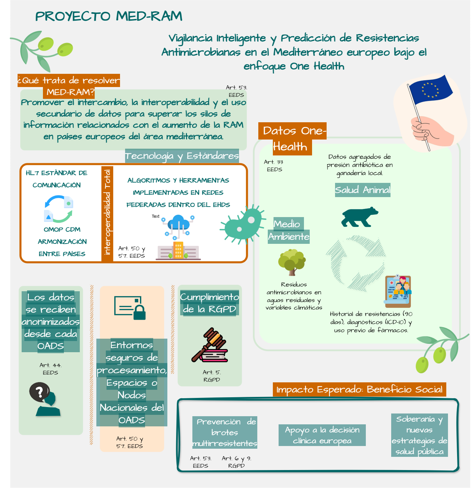

# Portfolio Módulo Final · Curso EEDS — CSIC
# PROYECTO MED-RAM

> **Vigilancia Inteligente y Predicción de Resistencias Antimicrobianas en el Mediterráneo europeo bajo el enfoque One Health**

📁 *Portfolio Módulo Final · Curso EEDS — CSIC*
🔗 [isaamarod.github.io/ehds-course-portfolio](https://isaamarod.github.io/ehds-course-portfolio/)

---

## Introducción

El **Espacio Europeo de Datos de Salud (EEDS)**, regulado por el Reglamento (UE) 2024/1143, establece un marco jurídico y técnico pionero para superar la fragmentación de los sistemas sanitarios europeos. Esta arquitectura permite el **Uso Primario** para la asistencia transfronteriza y un **Uso Secundario** que garantiza el acceso seguro a datos para investigación y salud pública.

Como proyecto final de la formación impartida por el CSIC en el curso *"Espacio Europeo de Datos de Salud: retos y oportunidades en la asistencia sanitaria y en la investigación biomédica"*, **MED-RAM** se presenta como una propuesta ficticia de innovación que articula una solicitud formal de acceso a datos al EEDS bajo los preceptos legales de los Artículos 53 y 57, asegurando un tratamiento ético, lícito y transparente de la información.

Desde mi rol como **Ingeniera de la Salud**, MED-RAM propone una infraestructura que integra datos clínicos, veterinarios y ambientales bajo el Art. 33, aplicando un enfoque **One Health** sobre la **Resistencia Antimicrobiana (RAM)**. El proyecto emplea Inteligencia Artificial y aprendizaje federado ejecutado íntegramente en **Entornos Seguros de Procesamiento (ESP)**. De este modo, se garantiza que la vanguardia técnica conviva con la máxima protección de la privacidad y la soberanía del dato europeo, transformando información multisectorial en inteligencia epidemiológica crítica para la Unión Europea.

MED-RAM centra su alcance en el **arco mediterráneo**: España, Francia, Italia, Grecia, Malta, Chipre, Eslovenia y Croacia. Esta región, pese a su heterogeneidad sanitaria, comparte desafíos climáticos y biológicos críticos que el EEDS permite armonizar para generar análisis epidemiológicos sin comprometer la privacidad ni la soberanía del dato en Europa.



---

## Índice

- [🚀 Sección 1 — Contexto y Problema](#-sección-1-contexto-y-problema)
- [⚖️ Sección 2 — Marco Legal y Derechos](#️-sección-2-marco-legal-y-derechos)
- [🛠️ Sección 3 — Tecnología, Estándares y Seguridad](#️-sección-3-tecnología-estándares-y-seguridad)
- [🏛️ Sección 4 — Gobernanza y Actores](#️-sección-4-gobernanza-y-actores)
- [📈 Sección 5 — Impacto y Reflexión](#-sección-5-impacto-y-reflexión)

---

## 🚀 Sección 1: Contexto y Problema

**Mi Rol:** Innovadora Tecnológica · Ingeniera de la Salud con roles de **Data Scientist (DS)** y **Data Engineer (DE)**

Actualmente trabajo como DS y DE en el proyecto **HealthDataMAD-R&I®**, nodo regional de la Comunidad de Madrid integrado en la iniciativa del EEDS. Mi labor me permite analizar de primera mano la complejidad de las bases de datos poblacionales y las problemáticas relacionadas tanto a nivel clínico como a nivel de infraestructura software. El EEDS es una gran oportunidad para mejorar no sólo la calidad de los sistemas nacionales e internacionales sino la vida de los europeos y europeas.

Aunque en muchos contextos los roles de DS y DE comparten ciertos dominios de actuación, sus competencias pueden diferenciarse:

| Rol | Enfoque |
|:----|:-------------------|
| **Data Engineer** | Construir repositorios garantizando seguridad e interoperabilidad (HL7, OMOP, SNOMED, LOINC…); mantenimiento de repositorios que aseguren calidad y seguridad dentro del OADS nacional |
| **Data Scientist** | Creación y preparación de bases de datos coherentes con las hipótesis planteadas; calidad del dato desde perspectiva científica; análisis, modelado y validación de resultados en los ESP |

Mi objetivo en este entregable es integrar mis conocimientos previos como DS y DE en HealthData@MAD-R&I® con el marco normativo del curso, presentando el proyecto MED-RAM como propuesta de acceso a datos ante el OADS para combatir la RAM en el mediterráneo europeo.

---

### El Desafío

La **Resistencia Antimicrobiana (RAM)**, definida por la OMS como una *"pandemia silenciosa"*, requiere un enfoque **One Health** que integre datos clínicos, veterinarios y ambientales, enfrentándose a barreras que van más allá de la disponibilidad de información.

Como perfil híbrido científico-técnico, identifico que el desafío crítico radica en:

- **La interoperabilidad real** y el acceso seguro en entornos transfronterizos, donde la fragmentación de metadatos y las disparidades culturales en el registro clínico inducen sesgos cognitivos y de interpretación que comprometen la representatividad de las cohortes.
- **La volatilidad biológica de la RAM**, que exige una orquestación continua para mitigar efectos como el *Data & Model Drift*, transformando lo que hoy son silos aislados en infraestructuras colectivas de avance científico.

El **EEDS** permite superar los silos de información mediante:
- 📂 **Acceso secundario a datos multisectoriales** (Art. 33)
- 🤖 **Uso de IA y Machine Learning** para predecir y controlar brotes de RAM, controlar el uso de antibióticos y construir nuevas guías de salud pública

---

## ⚖️ Sección 2: Marco Legal y Derechos

### A) Derechos del Paciente en MED-RAM

Los **6 derechos principales**: acceso · rectificación · portabilidad · restricción · oposición · derecho a no ser objeto de decisiones automatizadas.

**Aplicación en el proyecto:** MED-RAM no centralizaría los datos; utiliza el OADS como punto de acceso federado. El OADS habilita un Entorno Seguro de Procesamiento (ESP) donde se ejecuta la analítica avanzada bajo el cumplimiento del ENS. Los pacientes podrán verificar a través de sus carpetas de salud nacionales qué datos de sus antibiogramas han sido aportados al nodo nacional. Se respeta técnicamente el derecho de **restricción**: si un paciente limita el acceso a ciertos datos microbiológicos, estos serán filtrados y no entrarán en la creación de los modelos matemáticos.

---

### B) Fines Permitidos vs. Prohibidos

| | Artículo | Descripción |
|:---|:---|:---|
| ✅ **Permitido** | Art. 53.1.e/f | Investigación científica e innovación para el control de la RAM en la Europa mediterránea |
| ✅ **Permitido** | Art. 53.1.j | Vigilancia de amenazas transfronterizas al utilizar datos de varios países europeos |
| 🚫 **Prohibido** | Art. 54.1.a/b | Uso para marketing o cálculo de primas de seguros (bloqueado técnicamente) |

> Los pacientes que hayan padecido RAM tienen posibilidad de recaídas y, por tanto, mayor posibilidad de mortalidad. Esto podría afectar a su libertad a la hora de gestiones económicas o en seguros privados.

---

### C) Principios de Protección de Datos (RGPD)

Se aplican los **6 principios**: Licitud · Limitación de la finalidad · Minimización · Exactitud · Limitación del plazo · Integridad/Confidencialidad.

**🔍 Minimización** — En estricto cumplimiento del Art. 5 del RGPD y el Art. 44 del EEDS, la solicitud se limita a las variables técnicas esenciales:
- Identificadores seudonimizados
- Codificación diagnóstica ICD-10
- Perfiles de sensibilidad antibiótica (R/S/I)

Para mitigar riesgos de re-identificación, los datos temporales y demográficos se someten a técnicas de agregación, transformando fechas exactas en periodos de ingreso y edades en rangos decenales.

**🔒 Integridad y Confidencialidad** — El procesamiento se realiza exclusivamente en **Entornos Seguros de Procesamiento (ESP)** certificados bajo el **Esquema Nacional de Seguridad (ENS)**, garantizando que los datos nunca abandonen el control del OAD.

---

### D) Derecho de Autoexclusión (Opt-out)

Se respeta el derecho de **opt-out** de forma **reversible**. Si un paciente solicita que sus datos no se compartan transfronterizamente, el sistema lo excluirá de la recogida para uso secundario y no estaría incluido en el estudio.

> **Excepción:** Solo se anulará la restricción en situaciones de alertas de salud pública críticas (epidemias o pandemias), previo acuerdo del EHDS Board y de los OADs nacionales de los países involucrados.

---

### E) Mecanismos de Auditoría y Confianza

Se implementan **registros de acceso (logs) inmutables** para cada consulta de los datos de creación del algoritmo y para el razonamiento y acceso al mismo. Estos registros permiten la **trazabilidad total**.

**Supervisión:** El acceso es controlado por el **OAD** y auditado por las autoridades de protección de datos para detectar accesos no lícitos o por "curiosidad" que puedan conllevar una re-identificación.

---

### F) Consentimiento e Información al Paciente

La base legal se fundamenta en el **interés público y la investigación científica** (Art. 6 y 9 del RGPD).

> 💬 *"Tus datos de salud, junto con información ambiental y veterinaria, nos ayudan a predecir qué antibióticos dejarán de ser eficaces en tu región. En MED-RAM usamos esta información de forma anónima y segura para que los médicos elijan el tratamiento correcto más rápido y proteger a toda la comunidad frente a las superbacterias."*

---

## 🛠️ Sección 3: Tecnología, Estándares y Seguridad

### A) Arquitectura de Interoperabilidad

| Componente | Detalle |
|:-----------|:--------|
| **Estándares clínicos** | HL7 FHIR para comunicación de datos clínicos; OMOP CDM para armonización transfronteriza |
| **Vocabularios** | SNOMED, LOINC — con mapeo de variables y limpieza para armonización final |
| **Modelo de red** | **Federado** — el algoritmo de IA viaja a los datos en los nodos nacionales; los datos brutos nunca salen de su jurisdicción |
| **Arquitectura de procesamiento** | **Medallion** — trazabilidad completa del proceso de limpieza hasta el modelo de IA |
| **Librerías** | Frameworks de código abierto (Python/R) para normalización, reproducibles y auditables |
| **Metadatos y linaje** | Catálogos DCAT-AP para documentar origen, transformaciones y procedencia de cada variable |

---

### B) Modelo de Implementación — Red Federada

Se elige un **Modelo Federado** (inspirado en **EUCAIM**).

**¿Por qué?** Los datos de resistencia bacteriana son sensibles y provienen de sistemas distintos que posiblemente dificulten su estandarización. Incluso puede que se usen fármacos distintos dependiendo del país, lo que afecta al modelo. Este modelo permite que los datos permanezcan en su origen (hospital/nodo nacional) mientras un único algoritmo de IA viaja a ellos, o bien crear un modelo por cada país con sus sesgos propios y concatenar los resultados de riesgos.

| Ventajas | Desafíos |
|:---------|:---------|
| Mayor privacidad y cumplimiento del RGPD | Requiere armonización técnica muy estricta entre todos los nodos |
| Soberanía del dato en cada jurisdicción | O tratamiento propio por cada nodo dependiendo de los datos en crudo |

---

### C) Entornos Seguros de Procesamiento (ESP)

Para garantizar la seguridad de los datos sensibles (genómica y clínica):

- **Anonimización por defecto** para el entrenamiento de modelos
- **Seudonimización** gestionada por el OAD para estudios que requieran series temporales
- En caso de riesgo de re-identificación: técnicas de **K-anonimidad** o **Privacidad Diferencial**
- Si el riesgo persiste tras la agregación, los registros afectados serán **excluidos del conjunto de entrenamiento**
- **Auditoría:** Registros de acceso inmutables (logs) y cumplimiento obligatorio del **ENS**

---

### D) Referencia a Casos de Éxito

| Proyecto | Aplicación en MED-RAM |
|:---------|:----------------------|
| **HealthData@EU Pilot** | Adaptamos la infraestructura de conexión transfronteriza entre OADS para garantizar escalabilidad en el Mediterráneo |
| **TEHDAS** | Aplicamos sus marcos de gobernanza para asegurar que el uso secundario sea ético y genere confianza |
| **OHSIRIS** | Su modelo de "Ocean of Health Data" demuestra cómo integrar datos de múltiples hospitales en un repositorio heterogéneo regional. Usaríamos un esquema similar para consolidar datos de cada región europea |
| **EUCAIM** | Adoptamos la arquitectura de **red federada** para arquitecturas no armonizables, asegurando que los datos sensibles no salgan de su jurisdicción |

---

## 🏛️ Sección 4: Gobernanza y Actores

### A) Niveles de Gobernanza

| Nivel | Rol en MED-RAM |
|:------|:---------------|
| 🏥 **Local** (Hospital) | Los centros de salud y laboratorios actúan como **Tenedores de Datos**, custodiando la información original y garantizando su calidad |
| 🇪🇸 **Nacional** (OAD) | El **OAD** actúa como **Gatekeeper**, gestionando los permisos de acceso y proporcionando el **ESP** (Soporte Técnico/Enabler) |
| 🇪🇺 **Europeo** (EHDS Board) | Coordina la interoperabilidad transfronteriza a través de **HealthData@EU** para que los datos de Grecia, Francia o Italia sean accesibles desde España (coordinador: OAD España) |

---

### B) Rol del OAD — Solicitud Simulada

**¿Qué solicitaría al OAD?**

Como responsable técnica de MED-RAM, solicitaría un **Permiso de Acceso a Datos para uso secundario** bajo el Art. 33 (Art. 33.1.1 a, e, i y n) que incluya:

- 📋 **Datos Clínicos:** Resultados de antibiogramas y consumo de antibióticos (HCE) de los últimos 5 años (Art. 33.1.a, Art. 33.1.i), armonizados bajo OMOP CDM
- 🌿 **Datos One Health:** Vinculación con determinantes ambientales (Art. 33.1.e) y presión antibiótica animal (Art. 33.1.n)
- 💻 **Recurso Técnico:** Acceso a un ESP con capacidad de computación para entrenar modelos de IA bajo Art. 57

**¿Criterios de evaluación?**

| Criterio | Descripción |
|:---------|:------------|
| **Finalidad** | Que el proyecto se ajuste a los fines permitidos (Art. 53): protección contra amenazas transfronterizas e investigación científica |
| **Minimización** | Que no se soliciten más datos de los necesarios para entrenar el algoritmo |
| **Viabilidad Técnica** | Demostrar capacidad para trabajar en red federada y utilizar estándares europeos (HL7 FHIR / xShare) |
| **Ética y Seguridad** | Verificación de ausencia de riesgos de re-identificación y justificación del beneficio social |

---

### 📄 Solicitud Formal al OAD

**Asunto:** Solicitud de acceso secundario a datos de salud electrónicos — Proyecto MED-RAM

**1. Base Lícita y Finalidad**
De acuerdo con el **Art. 53.1 (c) e (j)** del Reglamento (UE) 2024/1143, solicitamos acceso para fines de **investigación científica y protección contra amenazas transfronterizas graves para la salud** para el proyecto MED-RAM *"Vigilancia Inteligente y Predicción de Resistencias Antimicrobianas en el Mediterráneo europeo bajo el enfoque One Health"*.

**2. Categorías de Datos (Art. 33.1)**
- **(a)** Historias clínicas y resultados microbiológicos seudonimizados
- **(e)** Determinantes ambientales y factores de influencia en salud
- **(n)** Datos de salud procedentes de sectores afines (Sanidad Animal)

**3. Especificaciones Técnicas y Seguridad**
- **Interoperabilidad:** Datos armonizados mediante **OMOP CDM** y comunicación vía **HL7 FHIR / xShare**
- **Seguridad (Art. 50):** Procesamiento exclusivo en **ESP** nacional bajo cumplimiento del **ENS**, garantizando la inamovilidad de los datos brutos

**4. Compromiso del Usuario (Art. 57)**
El consorcio asume las obligaciones de **no re-identificación**, notificación de incidentes y **publicación de resultados agregados**, garantizando la transparencia y el retorno social de la innovación.

---

### C) Actores Involucrados

| Actor | Rol |
|:------|:----|
| 🏥 **Tenedores** | Hospitales, laboratorios y agencias de sanidad animal/ambiental |
| 🔬 **Usuarios** | Investigadores de la FiiBAP y autoridades de salud pública |
| 👤 **Pacientes** | **Prosumers** que aportan sus datos y se benefician de una mejor medicina de precisión |
| 🏛️ **Autoridades regulatorias** | ECDC, EMA y EFSA como receptores de la inteligencia epidemiológica generada |

---

### D) Confianza y Transparencia

Se implementan **portales de transparencia** que detallan el uso de datos en MED-RAM y su impacto social. El proyecto integraría un **comité multidisciplinar** de expertos de cada país involucrado, garantizando que el análisis clínico y técnico cuente con validación científica local y transfronteriza. Este rigor, unido a cuadros de mando para los profesionales sanitarios y reportes para las entidades de salud pública.

---

## 📈 Sección 5: Impacto y Reflexión

### A) Beneficios Esperados

| Destinatario | Beneficio |
|:-------------|:----------|
| 🐄 **Pacientes, ganaderos y entidades de regulación ambiental** | Mejora del conocimiento y empoderamiento del uso adecuado de antibióticos |
| 🩺 **Médicos** | Prescripción de precisión basada en datos locales en tiempo real; guías adaptadas a la realidad microbiológica local |
| 🔬 **Investigadores** | Acceso a un dataset masivo y armonizado único en el mundo |
| 🌍 **Sociedad** | Reducción de la mortalidad por bacterias multirresistentes; planes de salud pública; ahorro en costes hospitalarios y sistema más resiliente |

---

### B) KPIs — Indicadores de Éxito

| # | Indicador | Objetivo |
|:--|:----------|:---------|
| 1 | **Precisión y Validación** | >35% en detección temprana de cepas emergentes mediante Real World Evidence (RWE) |
| 2 | **Implantación** | Integración de al menos 3 países del arco mediterráneo europeo |
| 3 | **Drug Discovery** | Reducción del 25% en tiempo de identificación de nuevas dianas terapéuticas (Art. 34 EEDS) |
| 4 | **Uso de antibióticos** | Reducción del 15% en antibióticos de "último recurso" mediante prescripción dirigida |
| 5 | **Detección transfronteriza** | 90% de precisión en la detección temprana de patrones de resistencia |
| 6 | **Integración sectorial** | Datos de al menos 3 espacios (Salud, Agrícola, Pacto Verde) |

---

### C) Desafíos Anticipados

**⚙️ Técnicos**

| Desafío | Descripción |
|:--------|:------------|
| **Interoperabilidad One Health** | Dificultad en la convergencia de semánticas clínicas (HL7/OMOP) con datos ambientales; normalización del contexto local y granularidad de variables |
| **Discriminación algorítmica** | Análisis de sesgos sin perpetuar los que puedan ser discriminatorios |
| **Data & Model Drift** | Riesgo de degradación de precisión por cambios en patrones de prescripción o mutaciones bacterianas; requiere monitorización continua y re-entrenamiento en el ESP |
| **Escalabilidad e Integridad** | Complejidad en orquestación de metadatos bajo DCAT-AP y gestión de cargas de trabajo en infraestructuras distribuidas |
| **Orquestación en el ESP** | Desafíos en despliegue del modelo en contenedores seguros garantizando latencia y seguridad del nodo nacional |
| **Representatividad de Cohortes** | Riesgo de sesgo de selección por disparidad en digitalización de nodos y ejercicio del opt-out |

**⚖️ Legales**

- Fragmentación normativa por las diferentes interpretaciones nacionales del Art. 25 del EEDS respecto al derecho de oposición (opt-out), lo que puede afectar a la representatividad de las cohortes.

---

### D) Hoja de Ruta

```
Fase 1  [Meses  1- 8]  Solicitud al OAD · acuerdos de gobernanza · acceso a datos
                        mapeo a HL7 FHIR · análisis a priori de reglas de calidad

Fase 2  [Meses  9-18]  Estructura Medallion · limpieza y criterios de calidad
                        creación de modelos · diseño de herramientas de reporte

Fase 3  [Meses 19-28]  Primeras pruebas piloto in silico en cada OAD

Fase 4  [Meses 29-39]  Piloto en arquitectura federada mediterránea
                        (España · Francia · Italia · Grecia · Malta · Chipre · Eslovenia · Croacia)

Fase 5  [Meses 40+  ]  Escalamiento europeo · despliegue del sistema de alertas en tiempo real
```

---

## 💭 Reflexión Personal

Este curso ha supuesto para mí una verdadera apertura de horizontes. Me ha permitido comprender que la innovación en salud no es únicamente una cuestión técnica, sino también de gobernanza, marco legal y propósito compartido entre instituciones, profesionales, investigadores y pacientes.

En este contexto, tanto el **uso primario** como el **uso secundario** de los datos de salud son fundamentales. El uso primario contribuye a mejorar la atención clínica y la continuidad asistencial, mientras que el uso secundario abre grandes oportunidades para la investigación, la generación de conocimiento y el desarrollo de nuevas soluciones sanitarias, siempre contando con el papel clave de las **asociaciones de pacientes**.

Entre los principales retos para el futuro de la medicina europea se encuentran la superación de barreras culturales, lingüísticas y técnicas, así como la integración de los **determinantes sociales de la salud** en modelos de inteligencia artificial éticos y adecuadamente validados. En este sentido, también será especialmente relevante fortalecer la **evaluación de tecnologías sanitarias** y la validación de estos modelos en contextos clínicos reales.

Desde mi perspectiva técnica, también resulta muy interesante conocer las propuestas relacionadas con la **interoperabilidad y las arquitecturas de datos** que permitirán hacer posible este ecosistema. No obstante, en algunos aspectos aún percibo cierta falta de concreción técnica, por lo que espero que en el futuro estos marcos y estándares puedan definirse con mayor claridad para facilitar su implementación real.

Además, considero que este nuevo ecosistema de datos representa una gran oportunidad para avanzar en áreas históricamente infraestudiadas, como la **salud de las mujeres**, incluyendo aspectos como los efectos secundarios de los tratamientos, el diagnóstico más temprano de enfermedades o el estudio de patologías autoinmunes más prevalentes en mujeres.

En definitiva, el **Espacio Europeo de Datos Sanitarios** representa una oportunidad única para transformar los datos clínicos en conocimiento útil y contribuir a una medicina más equitativa y basada en evidencia en Europa.

---

<div align="center">

*Portfolio Módulo Final · Curso EEDS — CSIC*
*Ingeniera de la Salud · Data Scientist · Data Engineer*

</div>
